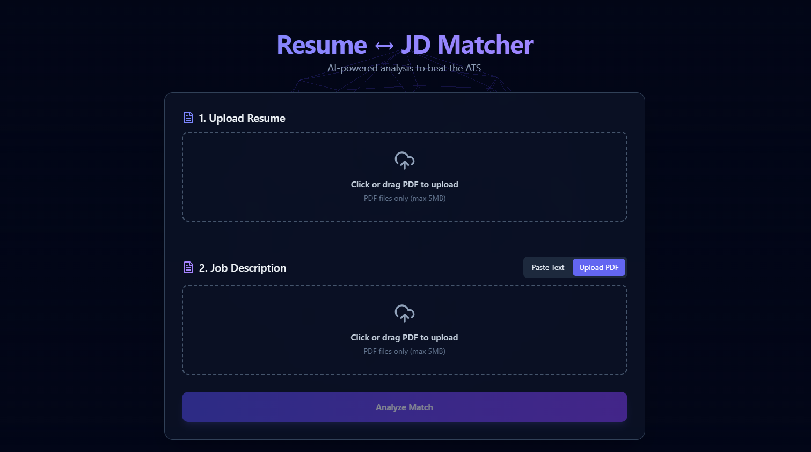
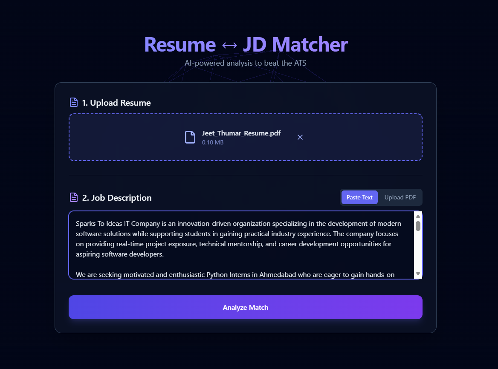
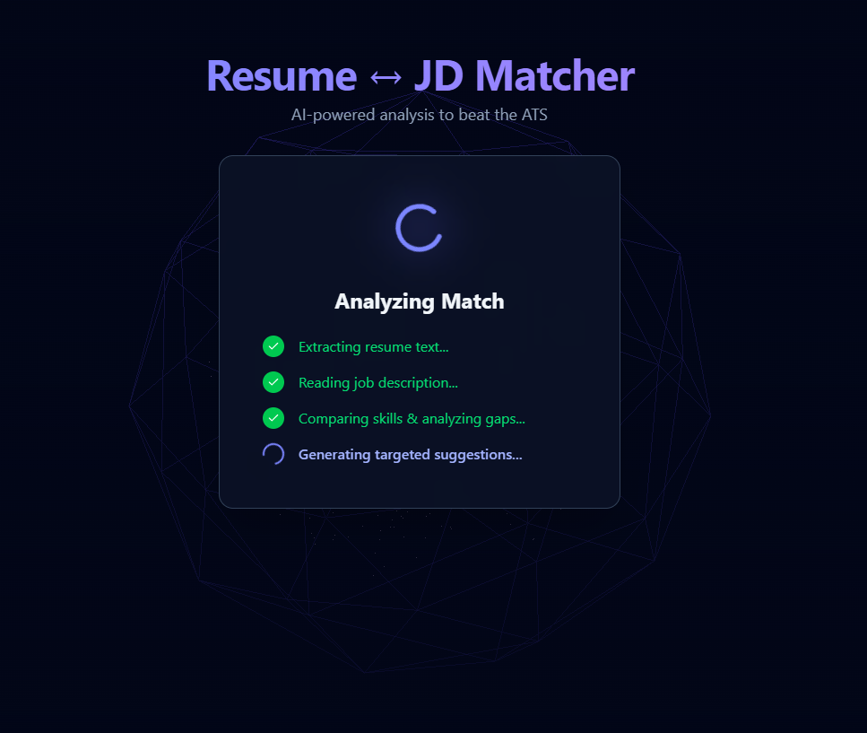
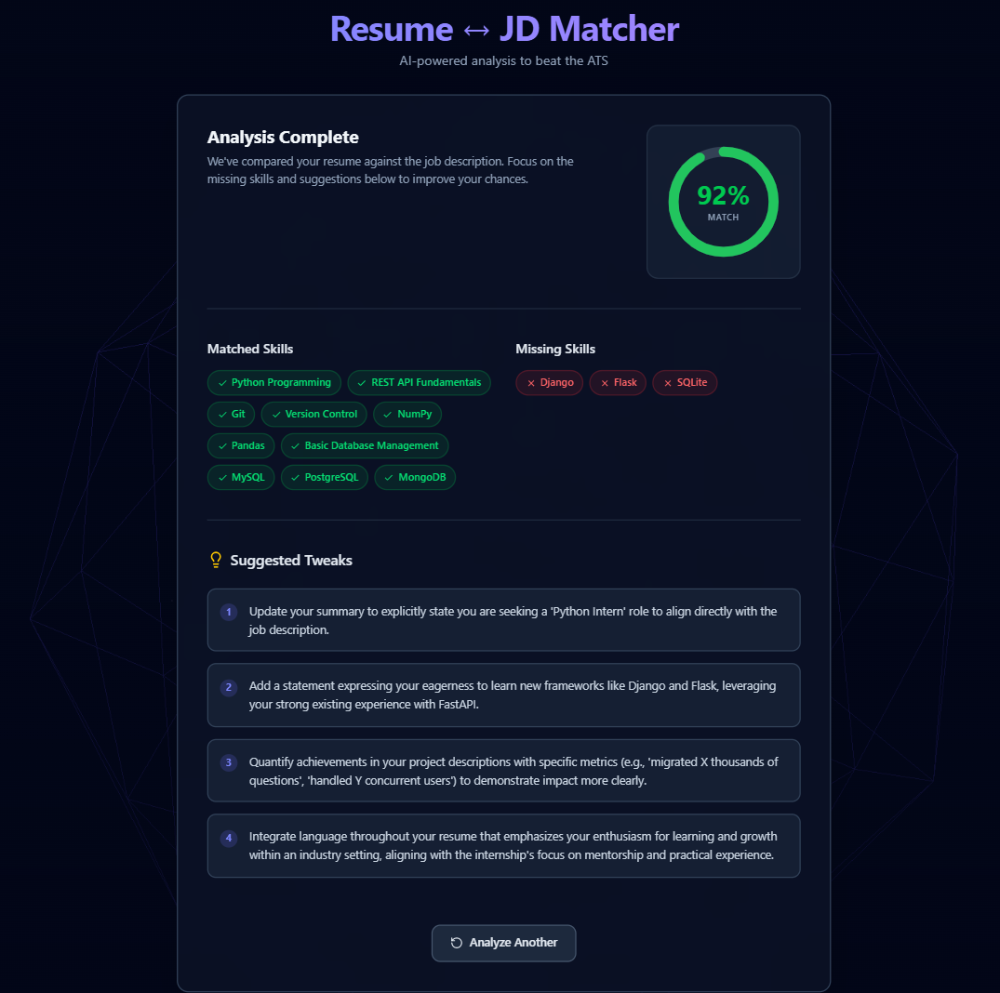

# Resume ↔ JD Matcher

An AI-powered tool that analyzes how well your resume matches a job description — instantly surfacing your match score, matched/missing skills, and specific resume tweaks to improve your fit.



## Screenshots

| Upload | Processing | Results |
|--------|-----------|---------|
|  |  |  |

## Features

- 📄 Upload your resume as a PDF (or paste text)
- 💼 Paste or upload a job description
- 🎯 Get an instant AI-generated match score (0–100)
- ✅ See matched skills and ❌ missing skills at a glance
- 💡 Receive specific, actionable resume tweaks
- 🎨 Interactive UI with animated processing steps and a 3D background

## Tech Stack

**Frontend**
- React (Vite)
- Tailwind CSS
- Framer Motion (animations)
- React Three Fiber (3D background)

**Backend**
- FastAPI (Python)
- pdfplumber (PDF text extraction)
- Google Gemini API (gemini-2.5-flash)

## Setup

### Prerequisites
- Python 3.11+
- Node.js 18+
- A Gemini API key (get one free at [aistudio.google.com](https://aistudio.google.com/app/apikey))

### Clone the repo
```bash
git clone https://github.com/JeetThumar/resume-jd-matcher.git
cd resume-jd-matcher
```

### Backend setup
```bash
cd backend
python -m venv venv
source venv/bin/activate   # Windows: venv\Scripts\activate
pip install -r requirements.txt
cp .env.example .env       # add your GEMINI_API_KEY here
uvicorn main:app --reload
```
Backend runs at `http://localhost:8000`

### Frontend setup
```bash
cd frontend
npm install
npm run dev
```
Frontend runs at `http://localhost:5173`

---

## Environment Variables

### Backend (`backend/.env`) — **secret, never commit**

| Variable | Required | Description |
|---|---|---|
| `GEMINI_API_KEY` | ✅ Yes | Google Gemini API key. Get one free at [aistudio.google.com](https://aistudio.google.com/app/apikey). **Set in the Render dashboard** for production — never hardcode. |

### Frontend — **public URL only, no secrets**

| Variable | Description | Dev value | Prod value |
|---|---|---|---|
| `VITE_API_URL` | Base URL of the FastAPI backend | `http://localhost:8000` | `https://resume-jd-matcher-e1mq.onrender.com` |

In development: Vite reads `frontend/.env.development` automatically.  
In production: set `VITE_API_URL` in the **Vercel dashboard** → Project Settings → Environment Variables.

> ⚠️ Never put `GEMINI_API_KEY` or any secret in a `VITE_*` variable — Vite embeds those in the browser bundle.

## How it works

1. Upload your resume (PDF) and paste/upload a job description
2. The backend extracts text from both documents
3. The Gemini API compares them and returns a structured match analysis
4. Results are displayed with matched/missing skills and tailored suggestions

## Future Improvements

- [ ] PDF export of analysis results
- [ ] Save analysis history (local storage or SQLite)
- [ ] ATS strict mode toggle
- [ ] Cover letter generator based on match results

## License

MIT

---

Built by [Jeet Thumar](https://linkedin.com/in/jeetkishorbhaithumar) — [GitHub](https://github.com/JeetThumar)